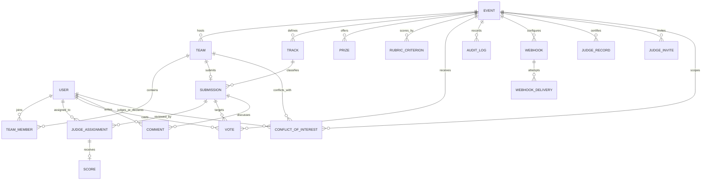

# Data model

PostgreSQL is the source of truth. Prisma schema: `prisma/schema.prisma`. Seed and schema setup are idempotently invoked by the Compose `seed` service.

`User.role` is a server-checked enum. `TeamMember` is the many-to-many membership join. Each team can own at most one submission. Submissions belong to one event and track and are either draft or submitted. `RubricCriterion.weight` values are validated as a 100% total by organizer endpoints. `Score.values` stores criterion-to-number JSON while `Score.total` stores its weighted result. `JudgeAssignment` is unique per submission/judge. `ConflictOfInterest` links one judge to exactly one team or participant within an event; `active` supports manager overrides, and declaration/override actors and timestamps are retained. Event/judge/target unique indexes prevent duplicate declarations. Vote uniqueness is `(eventId,userId)` and `(eventId,ipHash)`; IP values are HMACed before storage. `AuditLog` is append-only by application convention and has no update/delete API. Score edits use `score.edited` AuditLog entries with old/new values, changed criteria, optional reason, judge, and submission; calibration and ranking are computed from stored scores and require no extra tables.

## Import/export

- `GET /api/events/{slug}/export?type=submissions|assignments|raw-scores|normalized-scores|results` returns CSV.
- `GET /api/events/{slug}/bulk` returns a versioned JSON snapshot with teams/members, submissions, and scores using portable names/emails rather than database IDs.
- `POST /api/events/{slug}/bulk` accepts the same version 1 JSON snapshot. It also accepts `text/csv` with `?type=teams|submissions|scores`; CSV team-member lists and score-value maps are JSON-encoded cells. Imports validate referenced accounts, tracks, judges, and rubric values in one transaction; score totals are recalculated from the destination rubric.
- `GET /api/events/{slug}/bulk?format=csv&type=teams|submissions|scores` exports round-trip CSV datasets. The separate `/export` endpoint remains the human-friendly reporting CSV surface.
- Fixture data is built by `prisma/seed.ts`; compose applies `prisma db push` then `prisma db seed`.